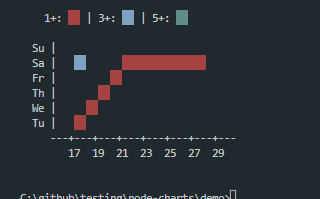

[](https://travis-ci.org/chunqiuyiyu/@wangnene2/chart)

[](https://standardjs.com)
[](https://packagephobia.now.sh/result?p=ervy)

> Bring charts to terminal

## New Charts

Heatmap:

Sample Code:

```js

console.log(annotation(notes))
const heatmap_plots = [];
SIZE_SQUARE = 2
WEEKS = 15
for (let i = 1; i < 13; i++) {
  i < 6 ? heatmap_plots.push({ key: '1+', value: [i, i], style: bg('red', SIZE_SQUARE) })
    : heatmap_plots.push({ key: '1+', value: [i, 6], style: bg('red', SIZE_SQUARE) })
}

heatmap_plots.push({ key: '3+', value: [2, 6], style: bg('blue', SIZE_SQUARE)})
heatmap_plots.push({ key: '5+', value: [6, 0], style: bg('cyan', SIZE_SQUARE) })

console.log(heatmap(heatmap_plots, { width: WEEKS , hName: "", vName: "", startsHAxis: 15, left: 4}) + '\n')

```

Results: 



Default options:

```json
  const newOpts = Object.assign({
    width: 5, //Amount of weeks
    left: 2,
    height: 7,
    style: '# ',
    sides: [1, 1],
    hAxis: ['+', '-', ''],
    vAxis: ['|', ''],
    hName: 'X',
    vName: 'Y',
    zero: '+',
    ratio: [1, 1],
    hGap: 2,
    vGap: 1,
    legendGap:0,
    startsHAxis: 15, //Start on the horizontal Line
    startsVAxis: 1, //Starts on the vertical Line
    VLabels: ['Mo ', 'Tu ', 'We ', 'Th ', 'Fr ', 'Sa ', 'Su ']
  }, opts)
```

## Supported Chart types

> From Previous Version

### Bar


### Pie


### Bullet


### Donut


### Gauge


### Scatter


## APIs

## main function
```js
ervy.[chartType](data, options)
```

## render colored characters
```js
// foreground color
ervy.fg(color, character)

// background color
ervy.bg(color, [length])
```
Supported color: black, red, green, yellow, blue, magenta, cyan and white.

Use [demo](/demo/index.js) to understand how to combine APIs in actual code.

## Credits

[@jcubic](https://github.com/jcubic)
[@chunqiuyiyu](https://github.com/chunqiuyiyu/ervy)

## License
[MIT](./LICENSE)
