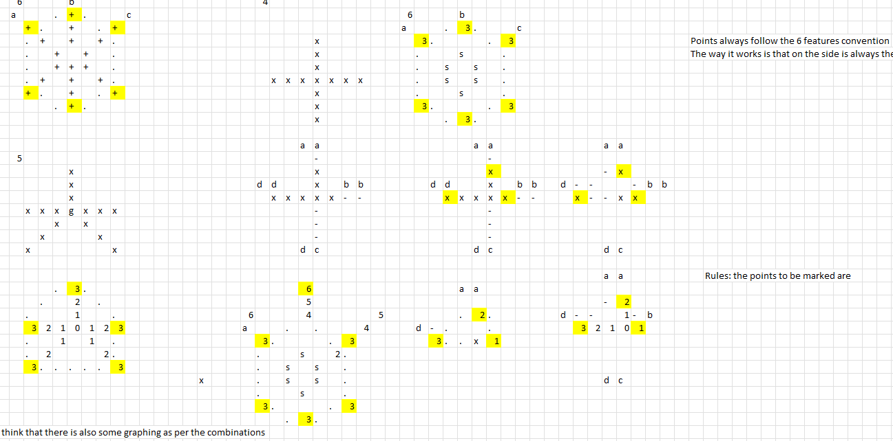
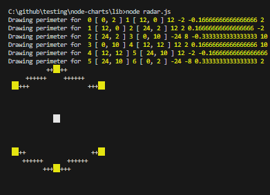
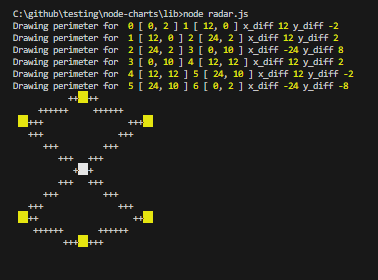
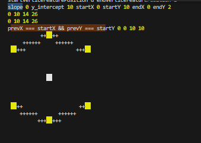

## Optimal formations for the future




>  Here I am figuring out the patterns for each edge.

- Note how is divided on top and bottom.
- With just some padding each oter lines.

## Trying to draw a radar 

### Attempt 1 




### Attempt 2







🤣🤣🤣🤣🤣🤣🤣🤣🤣🤣

Ok here it must be becuase it attempts the wrong orders. It should be 

a -> b -> c -> f -> e -> d -> a


But if you think about it. Each formation has its corresponding order.

Therefore convert the following into one that uses the ordered edges to create instead:


```js
  // Plot the perimeter
  if (draw_perimeter) {
    const perimeter = render_plots.slice(0);
    perimeter.push(perimeter[0]);
    for (let i = 0; i < perimeter.length - 1; i++) {
      let [x1, y1] = perimeter[i];
      const [x2, y2] = perimeter[i + 1];
      const x_diff = x2 - x1;
      const y_diff = y2 - y1;
      const slope = y_diff / x_diff;
      const y_intercept = y1 - slope * x1;
      console.log("Drawing perimeter for ", i, perimeter[i], i + 1, perimeter[i + 1],
        'x_diff', x_diff, 'y_diff', y_diff)

      while(x1 !== x2){
        const y = Math.round(slope * x1 + y_intercept);
        if (plots[y][x1] === undefined) {
          plots[y][x1] = '+';
        }
        x1 += x1 < x2 ? 1 : -1;
      }
    }

  }
```


