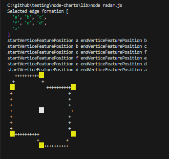

## Optimal formations for the future


>  Here I am figuring out the patterns for each edge.

- Note how is divided on top and bottom.
- With just some padding each oter lines.

## Trying to draw a radar 

### Attempt 1 


### Attempt 2


🤣🤣🤣🤣🤣🤣🤣🤣🤣🤣

Ok here it must be becuase it attempts the wrong orders. It should be 

a -> b -> c -> f -> e -> d -> a


But if you think about it. Each formation has its corresponding order.

Therefore convert the following into one that uses the ordered edges to create instead:


```js
  // Plot the perimeter
  if (draw_perimeter) {
    const perimeter = render_plots.slice(0);
    perimeter.push(perimeter[0]);
    for (let i = 0; i < perimeter.length - 1; i++) {
      let [x1, y1] = perimeter[i];
      const [x2, y2] = perimeter[i + 1];
      const x_diff = x2 - x1;
      const y_diff = y2 - y1;
      const slope = y_diff / x_diff;
      const y_intercept = y1 - slope * x1;
      console.log("Drawing perimeter for ", i, perimeter[i], i + 1, perimeter[i + 1],
        'x_diff', x_diff, 'y_diff', y_diff)

      while(x1 !== x2){
        const y = Math.round(slope * x1 + y_intercept);
        if (plots[y][x1] === undefined) {
          plots[y][x1] = '+';
        }
        x1 += x1 < x2 ? 1 : -1;
      }
    }

  }
```

Lets try again:

```js


  const edgesSorted = {
    1: [],
    2: ['b', 'e'],
    3: [...formations[2], 'a'],
    4: [...formations[3], 'a'],
    5: [...formations[4], 'a'],
    6: [...formations[5], 'a'],
  }

  ...
  const render_plots = {};

  ...
  
  radarData.forEach((feature, index) => {
    const { name, scaled_value, value } = feature;
    const feature_position = selectedFormation[index];
    const [x, y] = getPosition(scaled_value, feature_position);
    const colorForFeature = use_unique_colors ? colors[index] : default_color;
    plots[y][x * 2] = bg(colorForFeature, 2);
    // render_plots.push([x * 2, y]); // To be used for renering the perimeter.
    render_plots[feature_position] = [x * 2, y];
  });

```

That means that I am storing the radar featured position 'a', 'b'... as keys. And the values are the coordinates. 





